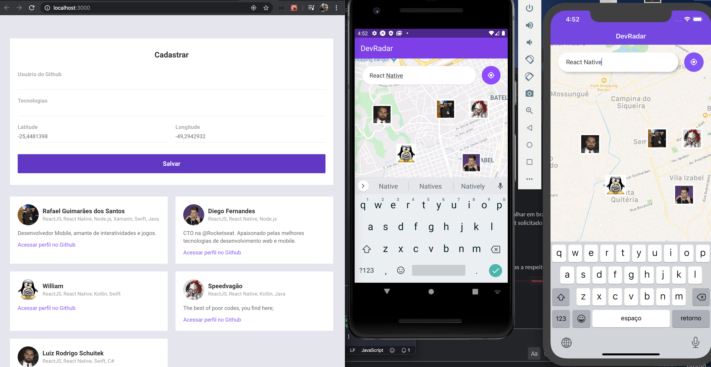

22/01
<h1 align="center">APP - ReactNative - OmminiStack 10</h1>

React Native + Expo !!! 

## React Native.
2015 ... pra frente - 
Todo codigo, Javascript.

Permite Alterações por plataforma...
Javascript Core...
* Não é convertido em código nativo.
Porem a interface, ele gera Nativo !

## Biblioteca Expo: 
... as vezes não vale a pena utilizar.
Framework, conjunto de ferramentas, para utilizar o que o celular tem de disponível.
Mapa, câmera, geolocalização.

Com o Expo: ele gerencia com o javascript.
* Tem que instalar o Aplicativo Expo nos devices !!!

Tem limitações 
Não suporta, Bluetooth no momento 
----------------------------------------------

Instalar o Expo:
### `yarn global add expo-cli`

Tem que ir na Documentação e atualizar: global path ...
Procurar na web por: yarn global path ... 
(https://yarnpkg.com/lang/en/docs/cli/global/)

Tem que adicionar no arquivo de inicialização:
### `export PATH="$(yarn global bin):$PATH"`

fazer: 
$ cd ~ 
$ code .bash_profile 

o arquivo pode ser: 
.bash_profile 
.bashrc 
.profile  
ou  
.zshrc
---------------------------------------------
## COMEÇANDO: 
Para começar o desenvolvimento do APP com o Expo, do zero...:
### `expo init mobile`

Para instalar o EXPO no emulador: 
https://www.youtube.com/watch?v=eSjFDWYkdxM

Pesquisar pelo documento: Expo commom issues Rocketseat ...

## Para abrir o menu:
Android: Command M  
IOS: Command D 
Device: Chacoalhar o device  

## Detalhes React Native:
elementos :
Semanticas, no ReactNative ... 
Usam componentes...
E estilização própria.

Não tem class nem id ...
usamos o: style={styles.container}

Não usamos hifem ... geralmente troca por uma letra maiuscula...
font-weight ... usamos fontWeight

* Não repassa o estilo aos elementos filho...
Cada elemento precisa de sua estilização...

## Babel:
Javascript moderno ... porem com o babel ele converte o js, para versões que precisem ...

app.json: Infos do app.
-------------------------
## Documentação do EXPO:
docs.expo.io 

https://docs.expo.io/versions/v36.0.0/guides/routing-and-navigation/

https://reactnavigation.org/

## Para instalar:
### `yarn add react-navigation`
### `yarn add @react-native-community/masked-view`

Como esta usando o Expo:
### `expo install react-native-gesture-handler react-native-reanimated react-native-screens react-native-safe-area-context`

Seguindo a docunentação:
https://reactnavigation.org/docs/en/hello-react-navigation.html

Instalar: (navegação por pilha, via botao...)
### `yarn add react-navigation-stack`

Existe a navegação: Por abas... ou via Drawer (Puxando o menu).
--------------
https://docs.expo.io/versions/v36.0.0/sdk/map-view/
Instalando a biblioteca de mapas:
### `expo install react-native-maps`

Pegar a localização do usuário: (Com permissoes)
https://docs.expo.io/versions/v36.0.0/sdk/location/

### `expo install expo-location`
----------------
Para instalar a webView:
### `expo install react-native-webview`

Para usar botões personalizados com ícones:
https://material.io/resources/icons/?style=baseline
nos nomes, em vez de underline, usamos hifem...

---------------
Para acessar a API, Rest.
### `yarn add axios`